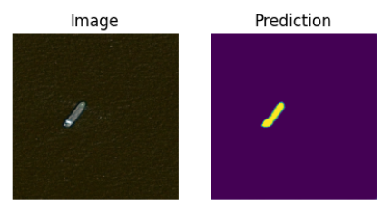
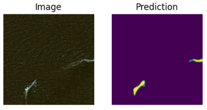
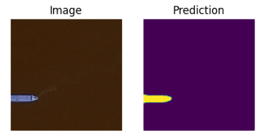
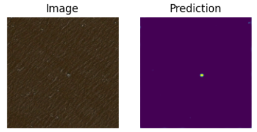
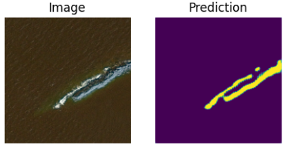

# Airbus Ship Detection Challenge

[Link to this challenge](https://www.kaggle.com/competitions/airbus-ship-detection/overview/description)

### Description of the task

The goal of the test project is to build a semantic segmentation model which that detects all ships in satellite images.
Preferred tools and notes: tf.keras, Unet architecture for neural network, dice score, python.

## Let`s explore our data

We have two datasets `test_v2` and `train_v2` consisting of 15,606 and 192,558 satellite images respectively.


As you can see, we have a lot of pics **without** ships, which means that we will need to balance our training dataset.

```
Number of images with ships:     42556 
Number of images without ships: 150000
Proportion: 0.3

Ratio with ships:     0.22
Ratio without ships:  0.78
```


We can observe from the graphs that the number of images without ships is significantly higher, with a count of 150,000,
compared to the images that contain ships, which amount to 42,556. This imbalance in the dataset should be considered in
future modeling efforts as it may introduce various challenges, such as an excessive number of false positives or
difficulties in accurately detecting ships.

Now, let’s proceed to determine the number of ships that can be identified within the available images.


As you can see from the histogram that in most cases only one ship is depicted, but we should not forget that most
satellite images are without ships.

## Training our model

### Data preparation

- **Balancing the Dataset**: To address the class imbalance issue mentioned earlier, the `unique_img_ids` DataFrame was
  balanced by sampling from each ship count group. The number of samples per group was determined by the `samples_group`
  variable.

- **Splitting Data into Training and Validation Sets**: The balanced dataset was split into training and validation sets
  using the `train_test_split` function. The split was performed based on the `ships` column, with a test size of 20%.
  The
  resulting training and validation sets were stored in train_df and valid_df, respectively.

- **Generating Image Data Generators**: Image data generators were created using the `make_image` function.

- **Data Augmentation Configuration**: To enhance the diversity of the training data and improve model generalization,
  data augmentation techniques were applied. The `create_augmentation` function was used to create an augmented
  generator.

### UNet

Now I will describe the UNet architecture, which is commonly used for image segmentation tasks. The UNet model is
implemented using the TensorFlow and Keras libraries.


The UNet architecture consists of a contracting path and an expanding path. The contracting path consists of several
convolutional and pooling layers that gradually reduce the spatial dimensions of the input. This helps capture
high-level features and context information. The expanding path consists of transpose convolutional layers that
upsample the feature maps and concatenate them with the corresponding feature maps from the contracting path. This
allows the model to recover spatial details and refine the segmentation. The final layer uses a sigmoid activation
function to produce the segmentation mask.

> Additionally, two loss functions are defined:

- **Intersection over Union (IoU) Loss**: This loss calculates the intersection over union between the predicted
  segmentation
  mask and the ground truth mask. It penalizes lower IoU values, encouraging the model to produce accurate
  segmentations.

- **Dice Coefficient**: This coefficient measures the similarity between the predicted and ground truth masks. It ranges
  from
  0 to 1, with 1 indicating a perfect match. It is used as a metric to evaluate the model's performance.

## Testing our model

To test the trained model, the `inference.py` can be used. A subset of images is randomly selected from the test files.
The number of images to check is defined by `num_images_to_check`.

Then, for each image in the selected subset, the `generate_prediction` function is generating predictions.
The `generate_prediction`
function takes the test directory, image file name, and the model as inputs. It reads the RGB image using `cv2.imread`
and performs any necessary preprocessing steps, such as scaling and converting the color space to RGB. Then, it feeds
the preprocessed image to the model for prediction using `model.predict`. The predicted mask is obtained and returned
after removing the batch dimension using `np.squeeze`. The function also returns the original image for comparison.

### Results:











As you can see, the model can predict the location of ships, but also it is not perfect and predicts some islands to be
ships.

## How to use my program?

First of all, configure all paths and settings in `config.py`.

```python
# Defining some properties
img_scaling = (3, 3)
max_train_steps = 10
max_train_epochs = 10
batch = 32
valid_img = 900
samples_group = 4000

# defining roots
base = '../test/'
train_root = base + '/train_v2/'
test_root = base + '/test_v2/'
```

After this, you can run `train.py`, which will train the model and save it in `model_folder`. To check whether our model
is working correctly you need to run `inference.py`, where you will see some randomly picked images from the test folder
and their predictions. Or you can just run `inference.py` because I have already provided the folder with the trained
model into this project.
